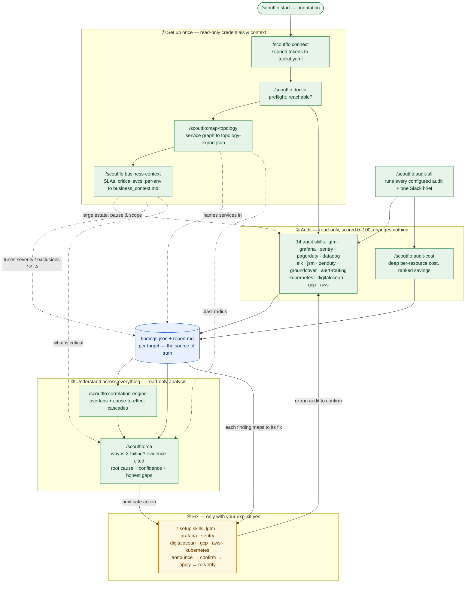

# Scoutflo AI Readiness

Audit, harden, and monitor your infrastructure and observability stacks from inside Claude Code — scored reports, guided fixes, Slack briefs, scheduled runs. Built from Scoutflo's own SRE consulting practice, packaged so you can run the same checks yourself, on your own systems, with your own credentials.

**The two guarantees this whole plugin is built around:**

1. **Everything runs on your side.** Every API call originates from your machine or your CI. Nothing is sent to Scoutflo — no telemetry, no report upload, no callbacks. The AI driving these skills never sees a secret value: it shows you the exact command to create and export a credential, and you run it yourself, in your own terminal. Reports stay on your filesystem.
2. **Nothing changes without your explicit yes.** Audit skills are strictly read-only — they list, get, and query, never create or modify anything. Setup skills (the ones that fix what an audit found) always show you the exact change first and wait for you to confirm before touching anything live.

---

## How it works (end to end)

The flow is: **set up once → audit (read-only) → understand across everything → optionally fix (only with your yes).** Every audit writes a `findings.json` (the machine-readable source of truth) and a human `report.md`; the correlation engine, cost roll-up, and RCA all read those artifacts — they never re-call your providers.



Green = read-only (safe, changes nothing) · amber = write, gated behind your confirmation · blue = the on-disk artifacts every analysis reads. Steps ③–④ are optional: many teams get full value from ② alone.

**Common use cases mapped to the flow:**

| You want to… | Do this |
| --- | --- |
| Score one stack's health | an `audit-*` skill (step ②) |
| Score everything at once | `/scoutflo:audit-all` |
| Find where you're wasting cloud spend | `/scoutflo:audit-cost` |
| Ask *"why is `<service>` failing — give me the RCA?"* | `/scoutflo:rca` (step ③, after audits + topology + business-context) |
| See redundant monitoring / cascade risk across stacks | `/scoutflo:correlation-engine` |
| Actually fix a finding | the matching `setup-*` skill (step ④, with your yes) |
| Run it on a schedule | `/scoutflo:schedule-audits` |

---

## What's new (current: v0.1.92)

- **ELK audits discover your Kibana spaces — never assume `default`.** `audit-elk` enumerates every space your key can see (`GET /api/spaces/space`) and audits where your rules actually live, so a stack whose alerting sits in a non-default space is no longer reported as an empty `0/100`. When zero rules are visible it says so honestly (a possible key-visibility gap: widen the key to `spaces:["*"]` read) instead of a confident wrong score. The `/scoutflo:connect` recipe now grants the correct Kibana feature privileges at all spaces.
- **A token you added is picked up in the same session.** Every audit now sources `~/.scoutflo/env` at its doctor gate, exactly as `/scoutflo:doctor` does — so a credential added mid-session works immediately, no new terminal. A new FAQ entry spells out where the token value goes (`~/.scoutflo/env`, keyed by the `*_env` name — not into `toolkit.yaml`).
- **Prometheus is first-class discoverable.** `audit-lgtm` is your Prometheus audit (scrape targets, rules, TSDB cardinality, retention); pair it with `audit-alert-routing` for the Prometheus→Alertmanager paging path. Both name Prometheus explicitly so "audit my Prometheus" finds them.
- **`/scoutflo:rca` — ask questions about your reports.** *"Why is `<service>` failing — give me the RCA?"* correlates every finding naming that resource across all stacks, the service topology, and business context into an **evidence-cited** root cause with a confidence level and an explicit "what I couldn't determine." Read-only; it never invents a cause — thin signal means it tells you which audit to run, not a guess.
- **`/scoutflo:audit-cost` — deep, per-resource cloud cost.** Queries each provider's own cost APIs (AWS Compute Optimizer / Cost Explorer, GCP Recommender, Datadog usage, Kubernetes requests-vs-usage, DigitalOcean billing) for ranked savings opportunities. Never invents a dollar figure — every number is copied verbatim from the provider or reported as a presence fact.
- **Business context as a source of truth** — `/scoutflo:business-context` captures SLAs per service, per-environment access/SLA, critical services, exclusions, and your own custom rules into one `business_context.md`; every audit reads it to tune severity and scope.
- **Large-estate scope checkpoint** — audits pause on a big estate and let you scope before spending tokens, instead of grinding everything.
- **Self-policing quality** — the numbers in every report reconcile with their own scorecard, secrets are never emitted, and each audit's behavior is enforced by CI gates (9 structure/parity gates + report self-validation, 19 test suites) so quality can't silently regress.

See [CHANGELOG.md](CHANGELOG.md) for the full v0.1.76 → v0.1.92 history.

---

## Install

Installing is a **one-time terminal step**. After that, use the plugin in any Claude surface that runs **locally on your machine** — the `claude` terminal CLI, or the Claude desktop app's **Code tab with the "Local" environment selected**.

> **Where it runs — read this first (it's the #1 support question).** Every skill executes real shell commands and reads/writes files on *your* machine (it creates `~/.scoutflo/toolkit.yaml`, runs `curl`/`kubectl`/`aws`, writes reports to your disk). So it needs a **local execution** surface. It works in: the `claude` terminal CLI, the desktop app's **Code tab set to Local**, and the VS Code / JetBrains Claude Code extensions. It does **not** work in the desktop app's **Chat tab** or **claude.ai in a browser** — those run in Anthropic-managed cloud VMs with no access to your machine, so a skill like `/scoutflo:connect` fails with "cannot create the toolkit file in your local environment." That error is expected — it just means you're in a cloud surface; switch to a Local session and re-run. (Pure-text skills like `/scoutflo:start` appear to work anywhere because they touch nothing local — don't take that as a sign the cloud surface will run the rest.)

**Step 1 — one time, in a real terminal window** (Terminal.app, iTerm, etc. — not the Claude.app chat box). If you don't have the `claude` command yet:

```bash
npm install -g @anthropic-ai/claude-code
```

Then, still in that terminal:

```bash
claude plugin marketplace add Scoutflo/ai-readiness
claude plugin install scoutflo@scoutflo
```

`/plugin marketplace add` and `/plugin install` only work as commands inside the standalone `claude` terminal CLI. They are **not** available as slash commands inside Claude.app's chat window — typing `/plugin ...` there will fail with "isn't available in this environment," which just means you're in the wrong surface for this one step, not that anything is broken. (The `/plugin` commands need a reasonably recent Claude Code — roughly v2.1.140 or newer; run `claude --version` and update if it's older.)

**Prefer not to touch a terminal at all?** Two options skip it: the **Team / Enterprise** paths in [docs/install.md](docs/install.md) add the marketplace and enable the plugin through a `settings.json` file (no `/plugin` command anywhere), and once the marketplace has been added by *any* of these paths, the Claude desktop app's built-in **plugin browser** (in the app's UI, not the chat box) can install and manage plugins from it. The one thing the desktop app can't do on its own is add a brand-new marketplace — that first step needs either the terminal command above or the `settings.json` entry.

**Step 2 — restart Claude Code / Claude.app** (fully quit and reopen, not just a new chat tab) so it picks up the plugin from the shared config the terminal command just wrote.

**Step 3 — everyday use, in a Local session** (the `claude` terminal CLI, or the desktop app's **Code tab → Local** — not the Chat tab / browser):

```
/scoutflo:start
```

That orients you — what's installed, what to do first, where reports land. Every skill after this (`/scoutflo:connect`, `/scoutflo:audit-lgtm`, etc.) is a normal slash command you type directly in that Local session. If `/scoutflo:connect` reports it can't write the toolkit file, you're in a cloud surface (Chat tab or browser) — switch to a Local session per the box above.

For team-wide or org-wide rollout instead of one person at a time, see [docs/install.md](docs/install.md).

## Your first 15 minutes

1. **`/scoutflo:connect`** — tell it which integrations you use (Grafana, Sentry, PagerDuty, Datadog, ELK/Kibana, JSM Operations, Zenduty, groundcover, Prometheus, DigitalOcean, GCP, AWS, whatever applies). For each one it shows you the exact click-path to create a minimal-scope, read-only credential in that provider's own UI, and the exact command to export it in your own shell. It never asks you to paste a token into the chat, and never runs that command for you.
2. **`/scoutflo:doctor`** — validates every credential you just set up with one cheap, read-only call per integration. Tells you exactly what's broken and how to fix it if anything is.
3. **`/scoutflo:map-topology`** (recommended, one time) — builds a real map of your services from Kubernetes/Istio. Once this exists, every audit report uses your actual service names instead of generic ones.
4. **Run your first audit** — pick whichever matches what you connected: `/scoutflo:audit-lgtm` (this is also your **Prometheus** audit — backend health, scrape targets, rules, cardinality; pair with `/scoutflo:audit-alert-routing` for the Prometheus→Alertmanager paging path), `/scoutflo:audit-grafana`, `/scoutflo:audit-sentry`, `/scoutflo:audit-pagerduty`, `/scoutflo:audit-datadog`, `/scoutflo:audit-elk`, `/scoutflo:audit-jsm`, `/scoutflo:audit-zenduty`, `/scoutflo:audit-groundcover`, `/scoutflo:audit-alert-routing`, `/scoutflo:audit-digitalocean`, `/scoutflo:audit-gcp`, or `/scoutflo:audit-aws`. Or run everything you've configured at once with `/scoutflo:audit-all`.
5. **Read the report** in `./scoutflo-audits/<target>/<date>/report.md` — a scored, evidence-backed breakdown of what's healthy and what isn't, with a direct pointer to the fix for each finding.

That's it — nothing else is required to get real value out of this.

## How credentials work

Every integration that supports scoped tokens gets one of two tiers:

| Tier | Used by | Can do |
| --- | --- | --- |
| **Read-only** | every `audit-*` skill, `doctor`, `map-topology` | List, get, query. Cannot create, modify, or delete anything. |
| **Elevated** | every `setup-*` skill | Read-only, plus the specific write scopes that setup skill needs. |

Start with read-only only. Add an elevated credential later, as a separate token, only when you're ready to actually fix something with a `setup-*` skill. `/scoutflo:connect` walks you through creating both, correctly scoped and named, per integration.

Secrets live only in environment variables you export yourself. `~/.scoutflo/toolkit.yaml` (the one config file every skill reads) holds only hosts, org names, and the *names* of the environment variables — never a value.

## What's in the box

**Harness** — the skills that wire everything together:

| Skill | What it does |
| --- | --- |
| `/scoutflo:start` | Orientation: what's installed, what to do first, where reports land |
| `/scoutflo:connect` | Guided credential setup per integration, two token tiers |
| `/scoutflo:doctor` | Preflight: config parses, env vars are set, one live check per integration |
| `/scoutflo:map-topology` | Builds your real service map from Kubernetes/Istio |
| `/scoutflo:audit-all` | Runs every audit you've configured, one combined report and Slack brief |
| `/scoutflo:schedule-audits` | Sets up recurring audits via GitHub Actions, cron, or a Claude cloud schedule |

**Audits** — read-only, scored 0–100, evidence-backed, change nothing. Beyond coverage, every audit also scores **alert hygiene** — flapping alerts, permanently-firing "wallpaper" rules, missing debounce, and noisy routing — so a healthy score means signal, not noise:

| Skill | What it covers |
| --- | --- |
| `/scoutflo:audit-lgtm` | **Prometheus**, Loki, Tempo, Mimir, VictoriaMetrics, and Alertmanager stack health — scrape targets, rule evaluation, TSDB cardinality, retention (for Prometheus **alert routing**, pair with `audit-alert-routing`) |
| `/scoutflo:audit-grafana` | Dashboard truthfulness, alert-rule wiring, query hygiene, datasource health |
| `/scoutflo:audit-sentry` | Org and project config, privacy scrubbing, alert-rule tiers, releases, monitors |
| `/scoutflo:audit-pagerduty` | Paging health: services, escalation policies, on-call coverage, alert grouping and noise, incident aging — plus a vendor-analytics-backed **actionability** section (auto-resolved share, MTTA, sleep-hour interruptions) when your plan and key allow |
| `/scoutflo:audit-datadog` | Monitor health: notification delivery and dead `@handles`, noise controls (recovery thresholds, no-data, renotify, auto-resolve), indefinite mutes and broad downtimes, SLO and composite coverage — plus a separate, non-scored **Cost & Resource Optimization** section from Datadog's own usage data |
| `/scoutflo:audit-elk` | Kibana Alerting across every space: rules that notify nobody or target a dead connector, rules stuck in execution error, noise controls (flapping detection, `alert_delay`, action throttling, indefinite snoozes), and rule-type coverage — version-aware for Kibana 9.x |
| `/scoutflo:audit-jsm` | JSM Operations paging (the Opsgenie successor) per team: escalations with no repeat, routing rules that join an empty schedule, disabled ingestion integrations, notification-policy noise (dedup, blanket suppress, auto-close, auto-restart storms), dead heartbeats, and unacknowledged-alert aging — MTTA computed from timestamps since there is no analytics API |
| `/scoutflo:audit-zenduty` | Zenduty (Xurrent IMR) paging: single-point-of-failure escalations, empty on-call rotations, disabled or deprecated (API-Integration) ingestion, alert-rule and `collation` noise controls (suppress drop-alls, flapping guards, entity_id dedup), open-ended recurring maintenance windows, and unacked aging — with MTTA/MTTR from Zenduty's own analytics, paced against tight per-endpoint rate limits |
| `/scoutflo:audit-groundcover` | groundcover monitors: per-monitor firing hygiene (`pendingFor` debounce, hysteresis resolve threshold, auto-resolve, no-data and execution-error state), notification noise (re-notification storms, resolve-churn, route-bypass, detect-but-page-nobody), paused monitors and open-ended recurring silences, and dead workflow destinations — honest about groundcover's no-grouping/no-inhibition/no-dedup ceiling |
| `/scoutflo:audit-kubernetes` | Kubernetes security and configuration: pod security policies, RBAC rules, network policies, resource limits, cluster exposure |
| `/scoutflo:audit-alert-routing` | Proves an alert actually reaches a human — rule → Alertmanager → receiver, live — and scores **alert noise / alert fatigue**: flapping, permanently-firing rules, missing `for` debounce, missing grouping or inhibition, duplicate delivery, resolve noise |
| `/scoutflo:audit-digitalocean` | App Platform, managed databases, uptime checks, alert routing |
| `/scoutflo:audit-gcp` | Cloud Monitoring, uptime checks, GKE telemetry, logging, load-balancer health |
| `/scoutflo:audit-aws` | CloudWatch alarms, SNS routing, EC2/ECS/EKS/Lambda/RDS health, uptime, log forwarding — plus a separate, non-scored **Cost & Resource Optimization** report sourced from AWS's own Compute Optimizer / Cost Explorer / Trusted Advisor |

**Setups** — fix what an audit found. Always: announce the exact change → wait for your yes → apply it → re-read the object to prove it landed:

| Skill | What it fixes |
| --- | --- |
| `/scoutflo:setup-lgtm` | Alert receivers/routing, retention, HA, exposure, service-label alignment |
| `/scoutflo:setup-grafana` | Datasources, dashboards, contact points, notification policies, alert rules |
| `/scoutflo:setup-sentry` | Projects, environments, privacy scrubbing, alert routing, monitors |
| `/scoutflo:setup-digitalocean` | Alert destinations, uptime checks, App Platform and database alerting |
| `/scoutflo:setup-gcp` | Notification channels, uptime checks, alert policies, dashboards |
| `/scoutflo:setup-aws` | CloudWatch alarms, SNS routing, log forwarding, account-level observability. Never automates a cost-driven change (resize/delete) — Cost & Resource Optimization findings are always plan-only, a decision for you to make deliberately |

(No `setup-alert-routing` yet — that's coming; today alert-routing findings point at `setup-lgtm` or `setup-grafana`.)

## Reading a report

Every audit run writes two files:

```
./scoutflo-audits/
  <target>/
    history.jsonl              # one line per run — reports render the score trend from it
    <YYYY-MM-DD>/
      findings.json            # machine-readable: score, severities, evidence
      report.md                # human-readable: summary, scorecard, findings, next actions
```

`report.md` opens with an executive summary and a score out of 100, then a weighted scorecard by category, a findings table (every finding has a severity, real evidence, and a direct pointer to the setup skill that fixes it), and a "next safe actions" list ordered so you can start at row 1 with nothing to prepare first. Re-run the same audit later and it shows you the delta — what got fixed, what's new, how the score moved.

A score of 85+ with full coverage of every critical service earns the "end-to-end" label; below that, the honest phrasing is "good base coverage" — this toolkit never inflates a partial setup into a false "you're covered."

Every `report.md` is validated against a fixed output-conformance standard before it is written, so the structure — summary, scorecard, findings table, next safe actions, evidence — is the same run to run and across every stack.

**Keep `./scoutflo-audits/` out of version control** — reports describe your real infrastructure. Add it to `.gitignore` before your first run (see [docs/install.md](docs/install.md) for the exact snippet).

## Requirements

- The `claude` terminal CLI (`npm install -g @anthropic-ai/claude-code`) — the simplest way to do the one-time install, and required if you go the individual-terminal route. (You can avoid the terminal entirely via the Team/Enterprise `settings.json` path, or the desktop app's plugin browser once the marketplace has been added — see [docs/install.md](docs/install.md).)
- Claude Code (latest), with an active subscription
- `bash`, `curl`, `jq` on your `PATH`
- **On Windows: install [Git for Windows](https://git-scm.com/downloads/win)** (select "Add to PATH" during setup) so Claude Code has Git Bash. Every skill runs POSIX `bash`; Claude Code auto-detects Git Bash and, if it is absent, falls back to PowerShell, which cannot run these commands. macOS and Linux already have a POSIX shell. See [docs/install.md](docs/install.md#windows) for the details and how to point Claude Code at a non-standard Git Bash path.
- The CLI for whatever you're auditing (`kubectl`/`istioctl` for Kubernetes, `doctl` for DigitalOcean, `gcloud` for GCP, `aws` for AWS) — `/scoutflo:doctor` tells you if anything's missing
- Admin access to each integration you connect, just long enough to create a scoped credential

## Troubleshooting

- **`/plugin isn't available in this environment.`** You typed a `/plugin ...` command inside Claude.app's chat window. `/plugin marketplace add` and `/plugin install` only run in the standalone `claude` terminal CLI — open a real terminal, run `claude`, and run the commands there (see Install above).
- **`/scoutflo:connect` (or any audit) says it can't create the toolkit file / can't run locally.** You're in a **cloud** Claude surface (the desktop app's **Chat tab**, or claude.ai in a browser) — those run in Anthropic's cloud with no access to your machine, so a skill that writes `~/.scoutflo/toolkit.yaml` or runs `curl`/`kubectl` can't work there. Switch to a **Local** session: the `claude` terminal CLI, or the desktop app's **Code tab with the "Local" environment selected**, then re-run. (`/scoutflo:start` works in a cloud surface because it's pure text — that's not a sign the rest will.)
- **`/plugin marketplace add` fails or hangs (in the terminal).** The marketplace fetches this **public** repo the same way `git` clones any public repo, so no GitHub login or token is required — but it does go over the network with `git` under the hood. In a locked-down corporate network the usual causes are a firewall/proxy blocking `github.com`, `git` not installed, or a proxy that needs authentication. Pre-flight test: `git clone https://github.com/Scoutflo/ai-readiness.git /tmp/air-test` — if that succeeds from the same machine, `/plugin marketplace add` will too.
- **After installing, the `/scoutflo:*` commands don't show up.** New plugin installs need a full restart to load — fully quit Claude Code / Claude.app and reopen it, not just a new chat/tab. An in-progress conversation, or even a new tab in an already-running app, won't pick up a plugin installed partway through the session.
- **A command says "not recognized here" but then answers anyway.** Some Claude Code clients have their own fixed list of built-in slash commands separate from installed-plugin commands; this message just means the client's own list doesn't include it, not that the skill failed. If it responds with real content right after, it worked.
- **(Windows) skill commands fail with PowerShell parse errors** (on `set -eu`, `[ ... ]`, pipes, etc.). Claude Code didn't find Git Bash and fell back to PowerShell, which can't run these POSIX commands. Install [Git for Windows](https://git-scm.com/downloads/win) with "Add to PATH", restart, and re-run — see [docs/install.md](docs/install.md#windows).

## Feedback and issues

Found a bug, or something confusing? Open an issue at [Scoutflo/ai-readiness](https://github.com/Scoutflo/ai-readiness/issues) with:

- which skill you ran and what you typed
- what you expected vs. what actually happened
- anything from `./scoutflo-audits/` that looks wrong (redact real hostnames/org names if you'd rather not share them)

Small friction is worth reporting too, not just crashes — confusing wording, a step that took longer than it should have, a question that was unclear.

## More

- Full install options — individual, team, enterprise-managed rollout: [docs/install.md](docs/install.md)
- Common questions: [docs/faq.md](docs/faq.md)
- Token costs and usage examples: [docs/token-costs.md](docs/token-costs.md)
- Contributing and release rules: [CONTRIBUTING.md](CONTRIBUTING.md)
- Skill-authoring conventions (for anyone extending this): [docs/skill-authoring-conventions.md](docs/skill-authoring-conventions.md)
- Full changelog: [CHANGELOG.md](CHANGELOG.md)

## License

Licensed under **Apache-2.0** — see the [LICENSE](LICENSE) file. This repository is public, so install fetches the plugin from `Scoutflo/ai-readiness` anonymously over HTTPS the same way `git` clones any public repo — no GitHub login or token required.
